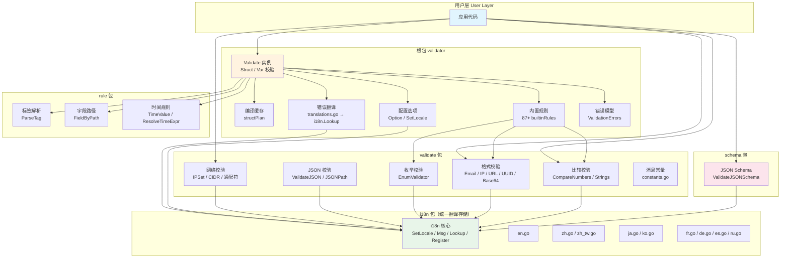

<div align="center">

# ⚡ Argus

**零依赖 · 高性能 · i18n 原生支持的 Go 结构体校验器**

[](https://pkg.go.dev/github.com/kamalyes/go-argus)
[](https://goreportcard.com/report/github.com/kamalyes/go-argus)
[](LICENSE)

[English](#) · [中文](#)

</div>

---

## ✨ 特性

- 🚀 **零第三方依赖** — 仅依赖 Go 标准库，供应链安全无忧
- 🏷️ **87+ 内置字段规则** — required、min/max、email、IP、UUID、datetime、Luhn 校验等
- 🔗 **跨字段规则** — range（范围校验）、fieldcontains（字段包含）、requiredWithout 等
- 🌍 **i18n 原生支持** — 内置 9 种语言翻译（en/zh/zh-TW/ja/ko/fr/de/es/ru），一行代码切换，可扩展任意语言
- 🔄 **go-playground/validator 兼容** — struct tag 语法和 API 高度兼容，迁移成本极低
- 🧩 **JSON Schema 校验** — 轻量 JSON Schema 子集校验，适合 API 网关场景
- 🔒 **并发安全** — 校验器实例可复用，struct 编译结果自动缓存
- 🛠️ **自定义规则** — 支持 `RegisterValidation` 注册自定义校验函数，支持 context 透传
- 📊 **数组化错误输出** — `TranslateValidationErrors` 直接输出可序列化的 JSON 错误
- 🌐 **网关工具** — IP 黑白名单（CIDR/通配符）、HTTP 状态码、Header、Content-Type、JSON Path 校验
- 📎 **格式校验** — email、IP、UUID、base64、URL、协议、WebSocket
- 📦 **泛型枚举校验器** — `NewEnumValidator[T]` 类型安全的枚举值校验
- 🔀 **标签逗号转义** — `\,` 在参数中保留逗号，`|` 作为替代分隔符
- 🛑 **规则执行策略** — 单字段失败即短路，其他字段不受影响

---

## 🏗️ 架构



## 📦 安装

```bash
go get github.com/kamalyes/go-argus
```

> 要求 Go 1.21+

## 🚀 快速开始

```go
package main

import (
    "fmt"
    "github.com/kamalyes/go-argus"
)

type User struct {
    Name  string `json:"name" validate:"required,min=2,max=50"`
    Email string `json:"email" validate:"required,email"`
    Age   int    `json:"age" validate:"gte=0,lte=150"`
}

func main() {
    v := validator.New()
    err := v.Struct(User{Name: "A", Email: "bad", Age: -1})

    // 一行切换语言
    validator.SetLocale("zh")
    messages := validator.TranslateValidationErrors(err, "zh")
    for _, msg := range messages {
        fmt.Printf("%s: %s\n", msg.Field, msg.Message)
    }
    // 注册新语言（9 种内置语言：en/zh/zh-TW/ja/ko/fr/de/es/ru）
    validator.RegisterI18nMessages("pt", map[string]string{
        "required": "{field} é obrigatório",
    })
    // name: name 不能小于 2
    // email: email 必须是有效的 Email
    // age: age 必须大于或等于 0
}
```

## 📚 文档

| 文档 | 说明 |
|------|------|
| [docs/tags.md](docs/tags.md) | 所有校验标签完整参考 |
| [docs/i18n.md](docs/i18n.md) | 国际化使用指南 |
| [docs/examples.md](docs/examples.md) | 完整使用示例 |

---

## 🔄 从 go-playground/validator 迁移

Argus 的 struct tag 语法和核心 API 与 `go-playground/validator` 高度兼容：

```go
// go-playground/validator
import "github.com/go-playground/validator/v10"
v := validator.New()

// Argus — 只需改 import 路径
import "github.com/kamalyes/go-argus"
v := validator.New()
```

主要差异：

| 特性 | go-playground/validator | Argus |
|------|------------------------|-------|
| 第三方依赖 | 多个（如 utranslator） | **零依赖** |
| i18n | 需额外安装 translator | **内置 9 种语言** |
| JSON Schema | 不支持 | **内置** |
| IP/CIDR/网络 | 不支持 | **内置** |
| 比较校验 | 不支持 | **内置** |

---

## 📄 License

[MIT License](LICENSE)
