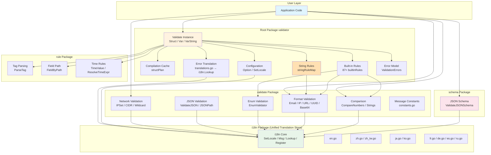

<div align="center">

# ⚡ Argus

**Zero-dependency · High-performance · i18n-native Go struct validator**

[](https://pkg.go.dev/github.com/kamalyes/go-argus)
[](https://goreportcard.com/report/github.com/kamalyes/go-argus)
[](LICENSE)

[English](#) · [中文](README.md)

</div>

---

## ✨ Features

- 🚀 **Zero third-party dependencies** — Only Go standard library, supply-chain secure
- ⚡ **Zero-reflection VarString fast path** — String variable validation bypasses `reflect` entirely, 0 heap allocations, 2~3× faster than reflection path
- 🏷️ **97+ built-in field rules** — required, min/max, email, IP, UUID, datetime, Luhn checksum, semver, ISBN, ISSN, BIC/SWIFT, cron, Data URI, BCP 47, Ethereum/Bitcoin address, etc.
- 🔗 **Cross-field rules** — range, fieldcontains, requiredWithout, etc.
- 🌍 **i18n native support** — 9 built-in language translations (en/zh/zh-TW/ja/ko/fr/de/es/ru), switch with one line, extensible to any language
- 🔄 **go-playground/validator compatible** — Struct tag syntax and API highly compatible, minimal migration cost
- 🧩 **JSON Schema validation** — Lightweight JSON Schema subset validation, suitable for API gateway scenarios
- 🔒 **Concurrency safe** — Validator instances are reusable, struct compilation results auto-cached
- 🛠️ **Custom rules** — `RegisterValidation` for custom validation functions, context propagation supported
- 📊 **Array-style error output** — `TranslateValidationErrors` outputs serializable JSON errors
- 🌐 **Gateway utilities** — IP allowlist/blocklist (CIDR/wildcard), HTTP status codes, headers, content types, JSON Path validation
- 📎 **Format validation** — email, IP, UUID, base64, URL, URI (including mailto/tel), protocol, WebSocket, semver, ISBN-10/13, ISSN, BIC/SWIFT, cron, Data URI, BCP 47 language tags, Ethereum/Bitcoin addresses
- 📦 **Generic enum validator** — `NewEnumValidator[T]` type-safe enum value validation
- 🔀 **Tag comma escaping** — `\,` preserves commas in parameters, `|` as alternative separator
- 🛑 **Rule execution policy** — Short-circuit on single field failure, other fields unaffected

---

## 🏗️ Architecture



## 📦 Installation

```bash
go get github.com/kamalyes/go-argus
```

> Requires Go 1.21+

## 🚀 Quick Start

```go
package main

import (
    "fmt"
    "github.com/kamalyes/go-argus"
)

type User struct {
    Name  string `json:"name" validate:"required,min=2,max=50"`
    Email string `json:"email" validate:"required,email"`
    Age   int    `json:"age" validate:"gte=0,lte=150"`
}

func main() {
    v := validator.New()
    err := v.Struct(User{Name: "A", Email: "bad", Age: -1})

    // Switch language with one line
    validator.SetLocale("en")
    messages := validator.TranslateValidationErrors(err, "en")
    for _, msg := range messages {
        fmt.Printf("%s: %s\n", msg.Field, msg.Message)
    }
    // Register new language (9 built-in: en/zh/zh-TW/ja/ko/fr/de/es/ru)
    validator.RegisterI18nMessages("pt", map[string]string{
        "required": "{field} é obrigatório",
    })
    // name: name must be at least 2 characters
    // email: email must be a valid email address
    // age: age must be greater than or equal to 0
}
```

## ⚡ VarString Zero-Reflection Fast Path

For string variable validation, `VarString` provides a zero-allocation fast path that completely bypasses `reflect`:

```go
v := validator.New()

// Traditional Var path — interface{} boxing + reflect
err := v.Var("user@example.com", "email")

// VarString zero-reflection path — direct string parameter, 0 heap allocations
err = v.VarString("user@example.com", "email")
```

**How it works:**

- `VarString` looks up `stringRuleMap` (zero-reflection implementations of all string-compatible rules) and calls rule functions directly with `string` parameters
- Unsupported rules (e.g., cross-field rules like `eqfield`, `required_if`) automatically fall back to the reflect path, maintaining full compatibility
- Errors return lightweight `stringFieldError`, which also implements the `FieldError` interface

**Supported zero-reflection rules:**

`required` · `min` · `max` · `len` · `eq` · `ne` · `gt` · `gte` · `lt` · `lte` · `alpha` · `alphanum` · `email` · `url` · `uri` · `ip` · `ipv4` · `ipv6` · `uuid` · `uuid3/4/5` · `semver` · `isbn10/13` · `issn` · `bic` · `cron` · `base64` · `json` · `hostname` · `fqdn` · `mac` · `cidr` · `e164` · `lowercase` · `uppercase` · `boolean` · `number` · `datetime` · `latitude` · `longitude` · `eth_addr` · `btc_addr` · `bcp47` · `datauri` · `oneof` · `oneofci` · `contains` · `startswith` · `endswith` and 70+ more rules

## 📚 Documentation

| Document | Description |
|----------|-------------|
| [docs/tags.md](docs/tags.md) | Complete reference for all validation tags |
| [docs/i18n.md](docs/i18n.md) | Internationalization guide |
| [docs/examples.md](docs/examples.md) | Complete usage examples |

---

## 🔄 Migrating from go-playground/validator

Argus's struct tag syntax and core API are highly compatible with `go-playground/validator`:

```go
// go-playground/validator
import "github.com/go-playground/validator/v10"
v := validator.New()

// Argus — just change the import path
import "github.com/kamalyes/go-argus"
v := validator.New()
```

Key differences:

| Feature | go-playground/validator | Argus |
|---------|------------------------|-------|
| Third-party dependencies | Multiple (e.g., utranslator) | **Zero** |
| i18n | Requires extra translator install | **9 built-in languages** |
| JSON Schema | Not supported | **Built-in** |
| IP/CIDR/Network | Not supported | **Built-in** |
| Zero-reflection string validation | Not supported | **VarString 0 allocs** |

---

## 🚀 Performance Benchmarks

Full performance comparison between Argus and `go-playground/validator/v10` is available at [go-argus-benchmark](https://github.com/kamalyes/go-argus-benchmark).

### VarString Zero-Reflection Path vs Var Reflection Path

| Rule | VarString (zero-reflect) | Var (reflect) | VarString Speedup |
|------|-------------------------|---------------|-------------------|
| `required` | **18 ns** / 0 B / 0 allocs | 49 ns / 16 B / 1 alloc | **2.7×** |
| `email` | **47 ns** / 0 B / 0 allocs | 81 ns / 16 B / 1 alloc | **1.7×** |
| `url` | **37 ns** / 0 B / 0 allocs | 64 ns / 16 B / 1 alloc | **1.7×** |
| `semver` | **28 ns** / 0 B / 0 allocs | 57 ns / 16 B / 1 alloc | **2.0×** |
| `isbn10` | **25 ns** / 0 B / 0 allocs | 60 ns / 16 B / 1 alloc | **2.4×** |
| `cron` | **44 ns** / 0 B / 0 allocs | 74 ns / 16 B / 1 alloc | **1.7×** |

### Argus vs go-playground/validator/v10

| Scenario | Argus | validator/v10 | Advantage |
|----------|------:|--------------:|:---------:|
| `Var_Email_Valid` | **87 ns** / 0 B / 0 allocs | 626 ns / 98 B / 5 allocs | 🚀 **7.2×** |
| `NestedWorkspace_Valid_Parallel` | **171 ns** / 192 B / 5 allocs | 768 ns / 1007 B / 33 allocs | 🚀 **4.5×** |
| `NestedWorkspace_Valid` | **1014 ns** / 192 B / 5 allocs | 3249 ns / 992 B / 33 allocs | 🚀 **3.2×** |
| `SimpleUser_Valid` | **341 ns** / 0 B / 0 allocs | 810 ns / 98 B / 5 allocs | 🚀 **2.4×** |

> Key optimizations: zero-reflection VarString fast path, hand-written email parser replacing `net/mail`, pre-compiled rule dispatch table, `sync.Pool` error object reuse, zero-allocation `isEmptyValue`, zero-allocation lowercase/uppercase byte checks, `json.NewDecoder` replacing `json.Valid`, lightweight URL/URI parsing replacing `net/url`, etc. See [go-argus-benchmark](https://github.com/kamalyes/go-argus-benchmark) for details.

---

## 🔗 Ecosystem

| Project | Description |
|---------|-------------|
| [go-rpc-gateway](https://github.com/kamalyes/go-rpc-gateway) | Next-gen enterprise microservice gateway framework with built-in Argus as gRPC/HTTP parameter validation engine |
| [go-pbmo](https://github.com/kamalyes/go-pbmo) | High-performance Protocol Buffer ↔ Model bidirectional conversion library with Argus field-level validation |
| [go-sqlbuilder](https://github.com/kamalyes/go-sqlbuilder) | Generic GORM repository layer using Argus to validate query parameters and model fields |
| [go-toolbox](https://github.com/kamalyes/go-toolbox) | Zero-dependency high-performance Go utility library with Argus validation for HTTP parameters, strings, and data structures |

### go-rpc-gateway Integration

[go-rpc-gateway](https://github.com/kamalyes/go-rpc-gateway) integrates Argus out of the box, providing struct tag-based gRPC interceptors. Combined with `protoc-go-inject-tag` to inject `validate:"..."` tags on generated pb code, no manual parameter validation needed:

```go
import "github.com/kamalyes/go-rpc-gateway/middleware"

// gRPC Unary interceptor — auto-validates validate tags on req
unary := middleware.StructTagValidatorUnaryInterceptor()

// gRPC Stream interceptor — auto-validates each stream message
stream := middleware.StructTagValidatorStreamInterceptor()
```

Validation failures automatically return `codes.InvalidArgument`. Fields without injected tags are skipped, no false positives.

---

## 📄 License

[MIT License](LICENSE)
